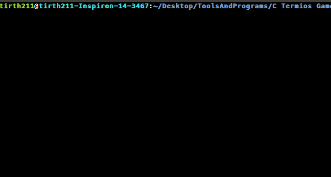

# TermioSnake
It is an implementation of snake game in C language using **<termios.h>** library to render the components in terminal
## Usage

    git clone https://github.com/tirth211/TermioSnake
	cd ./TermioSnake
	gcc -pthread Snake.C -o Snake.out
	./Snake.out
## Output
	

